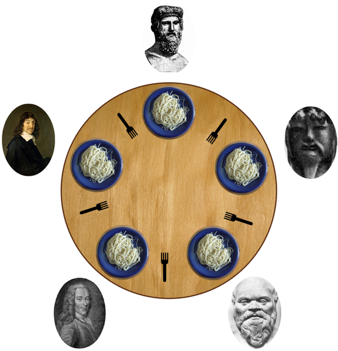

# philosophers_42



## Project Overview
---

**The Dining Philosopher Problem**  The Dining Philosopher Problem states that K philosophers seated around a circular table with one chopstick between each pair of philosophers. There is one chopstick between each philosopher. A philosopher may eat if he can pick up the two chopsticks adjacent to him. One chopstick may be picked up by any one of its adjacent followers but not both.

**Semaphore Solution to Dining Philosopher**
Each philosopher is represented by the following pseudocode:

```c
process P[i]
 while true do
   {  THINK;
      PICKUP(CHOPSTICK[i], CHOPSTICK[i+1 mod 5]);
      EAT;
      PUTDOWN(CHOPSTICK[i], CHOPSTICK[i+1 mod 5])
   }
```

## Rules

* This project is to be coded in C, following the 42 Norm. Any leak, crash, undefined
behavior or norm error means 0 to the project.

* A number of philosophers are sitting at a round table doing one of three things:
eating, thinking or sleeping.

* While eating, they are not thinking or sleeping, while sleeping, they are not eating
or thinking and of course, while thinking, they are not eating or sleeping.

* The philosophers sit at a circular table with a large bowl of spaghetti in the center.
* There are some forks on the table.

* As spaghetti is difficult to serve and eat with a single fork, it is assumed that a
philosopher must eat with two forks, one for each hand.

* The philosophers must never be starving.

* Every philosopher needs to eat.

* Philosophers don’t speak with each other.

* Philosophers don’t know when another philosopher is about to die. 

* Each time a philosopher has finished eating, he will drop his forks and start sleeping.

* When a philosopher is done sleeping, he will start thinking.

* The simulation stops when a philosopher dies.

* Each program should have the same options: number_of_philosophers time_to_die
time_to_eat time_to_sleep [number_of_times_each_philosopher_must_eat]

* **number_of_philosophers:** is the number of philosophers and also the number
of forks

* **time_to_die:** is in milliseconds, if a philosopher doesn’t start eating ’time_to_die’
milliseconds after starting his last meal or the beginning of the simulation, it
dies

* **time_to_eat:** is in milliseconds and is the time it takes for a philosopher to
eat. During that time he will need to keep the two forks.

* **time_to_sleep:** is in milliseconds and is the time the philosopher will spend
sleeping.

* **number_of_times_each_philosopher_must_eat:** argument is optional, if all
philosophers eat at least ’number_of_times_each_philosopher_must_eat’ the
simulation will stop. If not specified, the simulation will stop only at the death
of a philosopher.

* Each philosopher should be given a number from 1 to ’number_of_philosophers’.

* Philosopher number 1 is next to philosopher number ’number_of_philosophers’.
Any other philosopher with number N is seated between philosopher N - 1 and
philosopher N + 1

* Any change of status of a philosopher must be written as follows (with X replaced
with the philosopher number and timestamp_in_ms the current timestamp in milliseconds)
    * timestamp_in_ms X has taken a fork  
    * timestamp_in_ms X is sleeping  
    * timestamp_in_ms X is thinking  
    * timestamp_in_ms X died  

* The status printed should not be scrambled or intertwined with another philosopher’s status.

* You can’t have more than 10 ms between the death of a philosopher and when it
will print its death.

* Again, philosophers should avoid to die!

## Compiling and running
---

* **for mandatory part** :

```bash
$ cd philo
$ make
$ ./philo [number_of_philosopher (int)] [time_to_die (int)] [time_to_eat (int)] [time_to_sleep (int)] [number_of_times_each_philo_must_eat(optional arg)(int)]
```


* **for bonus part** :

```bash
$ cd philo_bonus
$ make
$ ./philo [number_of_philosopher (int)] [time_to_die (int)] [time_to_eat (int)] [time_to_sleep (int)] [number_of_times_each_philo_must_eat(optional arg)(int)]
```

